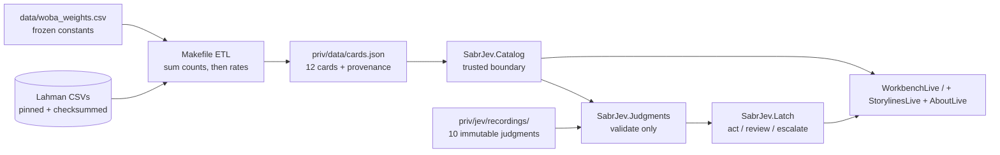
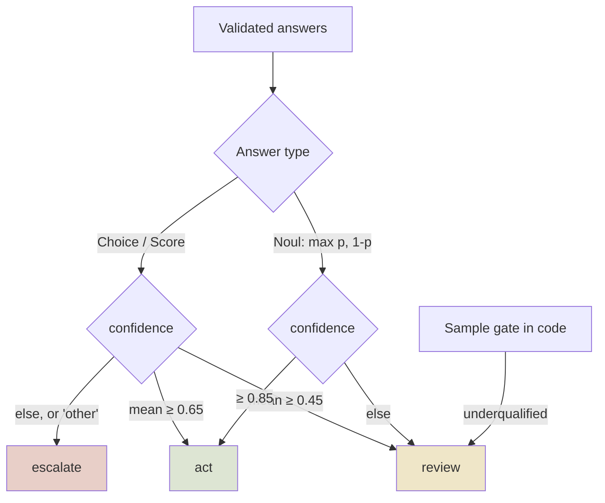

# Sabr-Jev — confidence-gated season-card workbench

[](https://elixir-lang.org)
[](https://www.phoenixframework.org)
[](LICENSE)
[](#non-negotiables)

Batter|Pitcher season cards from free public stats, graded by typed TypeSafe Jev
judgments behind a **confidence latch**. Season stats lie by omission — a hot
OPS hides a lucky BABIP, a shiny ERA hides a bad FIP. Sabr-Jev's value is the
verdict on the numbers: **act** on the read, **review** the full
probabilities, or **escalate** when the signal isn't there. Small samples can
never act, borderline calls never get a bold claim, and every judgment shows
its work. Without the latch this is a stat table; with it, it's a second
opinion you can audit.

Use it to sanity-check a breakout season before buying in, to flag regression
risk while there is still time to act on it, or as a reusable pattern for
putting any AI judgment behind fail-closed types, frozen state hashes, and a
prospective evaluation protocol instead of vibes.

## Results

 Fifty real cards from pinned Lahman inputs; 48 immutable Jev recordings; every latch route computed from frozen artifacts, never invented. Explore them as stories at `/storylines`, card by card in the workbench, and check the model against reality at `/backtest`.

| Slice | Detail |
|---|---|
| Cards | 50 (25 batter, 25 pitcher, seasons 2020–2025) |
| Recordings | 48 (43 with retrospective oracle Noul; 2025s Choice/Score-only; Strider 2023 has no oracle — 7 outs in 2024) |
| Unrecorded | Trout 2024, deGrom 2024 (underqualified demos — honest empty states) |
| Routes (v3 mean-aggregation) | 28 act · 17 review · 2 escalate — act = mean Choice/Score ≥ 0.65; per-answer probabilities stay visible |
| Backtest (retrospective) | 43 scored pairs: batter Brier 0.305 vs baseline 0.250; pitcher 0.280 vs 0.250 — no edge honestly claimed |

| Check | Result |
|---|---|
| Offline Elixir suite (`mix test`, no API key) | 133 passed |
| Python ETL + metric suite | 23 passed |
| `mix format --check-formatted`, `mix compile --warnings-as-errors` | clean |
| ETL rebuild of `priv/data/cards.json` | byte-identical |
| Live `/`, `/storylines`, `/about` | 200, content-checked |
| Prospective accuracy | **pending by design** — no cohort outcome exists yet. The enrollable cohort is the newest pinned season (2025 → 2026); that window closed 2026-01-01, and the 2026 → 2027 window opens when a 2026 source is pinned and closes 2027-01-01 |
| Latch thresholds | **provisional, revised v2** (act 0.65 / review 0.45; Noul act/review decoupled from the season read) |

## Use cases

| Who | Flow |
|---|---|
| Fan / analyst | Pick Batter\|Pitcher → player-season → read the card; the latch banner tells you whether the Jev read is actable, worth review, or escalated — with full probabilities, never a single bold claim under review |
| Story explorer | Start at `/storylines`: 37 famous 2020–2025 seasons with hook lines and real verdict chips, filtered by position/season/verdict, deep-linked into the workbench |
| Skeptic / auditor | Read `/backtest`: every recorded next-season projection scored against what actually happened — per-role Brier vs baseline, reliability buckets, per-pair losses |
| Developer | `SabrJev.Catalog` is the trusted boundary: exact keys, `id == role:player_id:year`, outer metrics == judgment-state metrics, PA/IP == sample value — mutations rejected before any Jev use |
| Researcher | Prospective pair (`mix sabr.record --prospective` / `mix sabr.capture` / `mix sabr.evaluate`) freezes a prediction before its outcome season under a Jan-1 cutoff: the Noul is recorded without an oracle marker, the ledger line carries `mode: prospective`, and scoring refuses anything that is not; Brier by role, baselines, reliability buckets, pending-not-negative outcomes |

## Design





Headlines are Lahman-feasible only. The latch diagram shows v2 bars. Revision note: under the original bars (act ≥ 0.8 on every Choice/Score, Noul-review demotion) act was unreachable across all 35 live recordings — max season_read confidence 0.68; the coupled Noul veto alone capped every act route at review. Formulas, provenance, and counting rules: [`docs/data.md`](docs/data.md). Prospective protocol: [`docs/evaluation.md`](docs/evaluation.md). Input pins: [`docs/data-sources.md`](docs/data-sources.md).

## Quick start

```sh
mix deps.get
mix test               # offline; recorded fixtures, no key needed
mix phx.server         # workbench :4000, formulas /about
make fetch data test-data   # ETL: pinned fetch, offline rebuild, offline tests
mix sabr.record --card batter:judgeaa01:2024   # live Jev (needs key)
```

## Non-negotiables

- No live Fangraphs/BBRef scrape — Lahman + committed weights file only.
- Jev never computes numbers; precomputed state JSON in, typed answers out.
- **OPS+ (Sabr-Jev)** label everywhere; no vendor-parity claim.
- No deterministic Noul; minimums (200 PA / 50 IP) live in code.
- No T+1 leakage: oracle joins are eval-only, never judgment state.
- Footer cites Lahman and says “no Fangraphs scrape in v1”. No Retrosheet
  data in v1. Count Gate stays parked; not Skipper.

## Demo deployment (Fly.io)

```sh
fly secrets set SECRET_KEY_BASE=$(mix phx.gen.secret)   # once; only secret needed
fly deploy                                              # builds Dockerfile, serves :4000
```

The image bakes in the frozen cards + recordings, so the instance needs no
API key and performs no live inference. Prospective ledger writes land in
`tmp/` and are ephemeral across restarts — mount a volume at `/data` if
capture demos must persist.
- Footer cites Lahman, “no Fangraphs scrape in v1”. No Retrosheet data in v1. Count Gate parked; not Skipper.

## License

Code: [MIT](LICENSE). Data: Lahman database, SABR via Sean Lahman, [CC-BY-SA-3.0](https://creativecommons.org/licenses/by-sa/3.0/) — attribution and share-alike apply to derived data. wOBA weights are third-party frozen constants, not project-owned; see [`docs/data-sources.md`](docs/data-sources.md).
